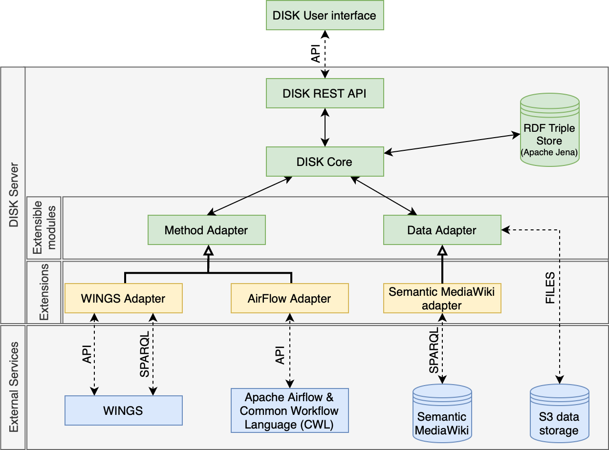

# DISK

DISK is a novel framework to test and revise hypotheses based on automatic analysis of scientific data repositories that grow over time. Given an input hypothesis, DISK is able to search for appropriate data to test it and revise it accordingly, and does this continuously as new data becomes available. DISK is also capable of triggering new kinds of analyses when new kinds of data become available.

An overview of the DISK services is shown below.

## Projects

DISK is composed of two main repositories, [the Web UI](https://github.com/KnowledgeCaptureAndDiscovery/DISK-UI) and [the backend API](https://github.com/KnowledgeCaptureAndDiscovery/DISK-API). 
You can find detailed information on how to deploy the software on their respective repositories.

## Links

- **Live portal:**     [https://neuro.disk.isi.edu/](https://neuro.disk.isi.edu/)
- **Web page:**        [https://w3id.org/disk/](https://w3id.org/disk/)
- **Documentation:**   [https://disk.readthedocs.io](https://disk.readthedocs.io)

